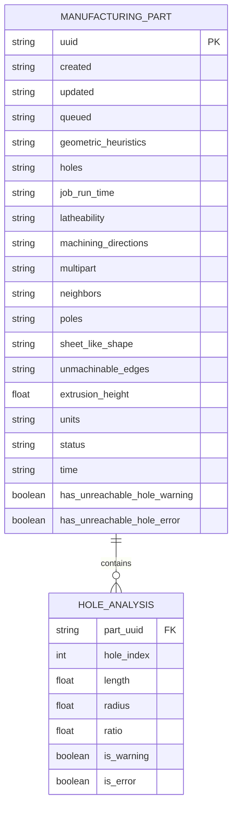

# Protolabs Design Data Pipeline

A Python data processing pipeline that analyzes 3D parts for manufacturing unreachability issues, specifically focusing on **unreachable holes** based on length-to-radius ratios.

## Problem Statement

In manufacturing, holes that are too deep relative to their diameter can be difficult or impossible to machine. This pipeline identifies such problematic holes using the following criteria:

- **Warning**: `length > radius × 2 × 10` (difficult to manufacture)
- **Error**: `length > radius × 2 × 40` (very difficult or impossible to manufacture)


## ETL Pipeline

```mermaid
flowchart LR
    subgraph "EXTRACT"
        A1[Load Parquet File]
        A2[Parse JSON Fields]
        A3[Validate Data Structure]
    end
    
    subgraph "TRANSFORM"
        B1[Iterate Through Parts]
        B2[Parse Holes JSON Array]
        B3[Calculate Length/Radius Ratios]
        B4[Apply Manufacturing Rules]
        B5[Set Warning/Error Flags]
    end
    
    subgraph "LOAD"
        C1[Add New Columns]
        C2[Save Processed Data]
        C3[Generate Statistics]
    end
    
    A1 --> A2 --> A3
    A3 --> B1 --> B2 --> B3 --> B4 --> B5
    B5 --> C1 --> C2 --> C3
    
    style A1 fill:#e3f2fd
    style B3 fill:#fff3e0
    style C2 fill:#e8f5e8
```



## Entity Relationship Diagram (ERD)


## Quick Start

### Prerequisites

- Python 3.9+
- Virtual environment (recommended)

### Installation

1. **Clone the repository**
   ```bash
   git clone <repository-url>
   cd protolabs_dfm_analysis
   ```

2. **Create and activate virtual environment**
   ```bash
   python -m venv venv
   source venv/bin/activate  # On Windows: venv\Scripts\activate
   ```

3. **Install dependencies**
   ```bash
   pip install -r requirements.txt
   ```

### Running the Pipeline

**Execute the main analysis:**
```bash
python -m src.main
```

**Run tests:**
```bash
python -m pytest tests/ -v
```
## Result 
The result of this project is a data processing pipeline that analyzes 3D part data to automatically flag manufacturing issues relating to unreachable holes. The code ingests the parquet dataset, processes the nested JSON data for each part's holes, and creates two new columns: has_unreachable_hole_warning and has_unreachable_hole_error to differentiate if a hole is unreachable for manufacturing or not. 

## Key Assumptions 
To build an effective solution, here are some of my key  operated under a few key assumptions:
The specific formula for unreachability  length / (radius * 2) is a business rule. The data contains lengths and radii, but it doesn't tell me how to combine them to determine if a hole is a problem.
I also assumed that values 10 (warning) and 40 (error) are defined externally, and there is nothing in the raw data that would suggest these numbers are important.


